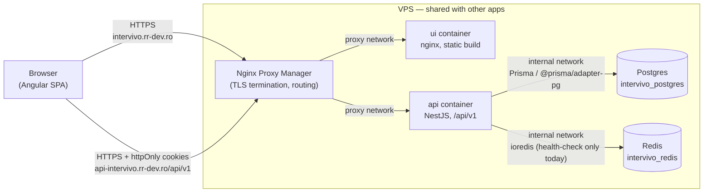
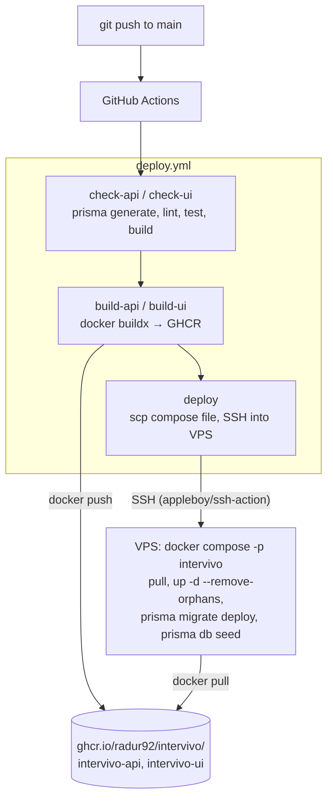

<p align="center"><strong>Intervivo</strong></p>
<p align="center">A recruiting / interview-tracking platform for HR teams and candidates.</p>

## Table of contents

- [Solution overview](#solution-overview)
- [Setup instructions](#setup-instructions)
- [Design decisions](#design-decisions)
- [Assumptions made](#assumptions-made)
- [Known limitations](#known-limitations)
- [Future improvements](#future-improvements)
- [Architecture description](#architecture-description)
  - [Data flow](#data-flow)
  - [Deployment approach](#deployment-approach)

## Solution overview

Intervivo has two user roles sharing one application:

- **HR** — manages candidates, schedules interview sessions, records feedback
  (rating, recommendation, strengths / improvement areas), and reads a
  dashboard and reports built from that data.
- **Candidate** — views their own profile and their interview history,
  including any feedback HR has published.

The two roles get separate route trees and layouts on the frontend
(`Shell` for HR, `CandidateShell` for candidates), enforced on both sides:
Angular route guards (`hrGuard` / `candidateGuard`) keep users out of pages
they shouldn't see, and a NestJS `RolesGuard` + `@Roles()` decorator enforce
the same boundary at the API regardless of what the client sends.

**Stack**

| Layer | Technology |
|---|---|
| Frontend | Angular 21 (standalone components, signals), Optimus UI v1, Tailwind CSS v4 |
| Backend | NestJS 12, Prisma 7 (`@prisma/adapter-pg` driver adapter) |
| Database | PostgreSQL |
| Cache / infra | Redis (via `ioredis`) |
| Auth | JWT access tokens + rotating opaque refresh tokens, httpOnly cookies |
| Deployment | Docker, GitHub Actions, GHCR, Nginx Proxy Manager |

## Setup instructions

### Prerequisites

- Node.js 22, npm
- Docker (for local Postgres/Redis, and for building deploy images)

### 1. Start local infrastructure

```bash
docker compose up -d
```

Brings up Postgres (`localhost:5434`) and Redis (`localhost:6381`) — offset
from the standard ports so they don't clash with other local projects.

### 2. Backend

```bash
cd api
cp .env.example .env      # DATABASE_URL / REDIS_URL already point at the ports above
npm install
npx prisma migrate deploy # apply the schema
npx prisma db seed        # optional: seed 1 HR + 5 candidates + 13 interview sessions + feedback
npm run start:dev
```

The API listens on `:3000` under the `/api/v1` prefix. Swagger docs are
available at `/api-docs` outside of production. Seeded login (password for
all seeded accounts is `password123`):

- HR: `alexander@systems.internal`
- Candidate: `jordan@candidates.internal` (plus 4 more, see `api/prisma/seed.ts`)

Cookies use `SameSite=None`, which requires HTTPS even in local dev. If no
cert is found at `api/certs/`, the server falls back to plain HTTP with a
warning — for the real thing, generate one with `mkcert`:

```bash
mkcert -install
mkcert -key-file api/certs/localhost-key.pem -cert-file api/certs/localhost-cert.pem localhost 127.0.0.1 ::1
```

### 3. Frontend

```bash
cd ui
npm install
npm start
```

Serves on `:4200`. The API base URL is a plain constant at
`ui/src/app/core/config/api.config.ts` (see [Deployment approach](#deployment-approach)
for how that's swapped for production).

### Tests

```bash
# api/
npm run lint && npm run test        # unit tests, no external services needed
npm run test:e2e                    # needs the docker-compose Postgres/Redis running

# ui/
npm run lint && npm run test && npm run build
```

## Design decisions

- **Enums mirror Prisma's own generated-enum shape.** `Role`,
  `InterviewStatus`, `InterviewType`, `Recommendation` are all
  `export const X = {...} as const; export type X = ...` pairs, on both
  frontend and backend, instead of raw string unions — keeps comparisons
  (`role === Role.HR`) type-checked instead of stringly-typed, and matches
  the pattern Prisma itself generates for schema enums.
- **Feedback is unique per `(session, author)`, not per session.** Multiple
  HR users can each leave independent feedback on the same interview; no one
  user can leave more than one. Ownership is checked on update (403 if
  you're not the author).
- **`CandidateProfile` is an app-layer invariant, not a DB one.** See
  [Known limitations](#known-limitations) — Postgres has no clean way to
  express "this row must exist because that column has this value" without
  a trigger, so the 1:1 relationship is enforced by always creating both
  rows together in one `$transaction`, in exactly one code path.
- **Error contract splits `code` (for the UI) from `message` (for
  developers).** Every error response is `{ statusCode, code, message }`
  with a numeric code registry by domain (1xxx auth, 2xxx users, 3xxx
  interviews, 4xxx feedback, 9xxx common). The frontend maps `code` to a
  curated, translated toast message via `getApiErrorMessage()`; `message` is
  never shown to the user.
- **Dashboard/reports aggregate client-side, not via dedicated endpoints.**
  Counts come from each paginated endpoint's `total` (cheap, independent of
  page size); richer aggregates (avg score, hire rate, monthly volume,
  per-candidate ranking) are computed in `HrStatsService` from a capped
  batch fetch. See [Known limitations](#known-limitations) for the cap.
- **`@db/*` instead of `@prisma/*` as a backend path alias**, specifically
  to avoid colliding with the real `@prisma/client` / `@prisma/adapter-pg`
  npm scope. Aliases are resolved at build time via `tsc-alias`, not Node's
  native `imports` field, because that field only supports `#`-prefixed
  keys and `@`-prefixed aliases were the requirement.
- **Deterministic seed IDs.** `api/prisma/seed.ts` seeds sessions/feedback
  with fixed string ids and `upsert`s everything, so it's safe to run on
  every deploy (see [Deployment approach](#deployment-approach)) without
  creating duplicates.

## Assumptions made

- **Single HR org, no multi-tenancy.** Every HR user sees every candidate
  and every session — there's no team/department scoping.
- **The VPS hosts multiple unrelated apps.** This drove real infra
  decisions, not just style: distinct Docker Compose project names
  (`-p intervivo`) so `--remove-orphans` can never touch another app's
  containers, and DB/Redis containers with no published host ports, reachable
  only over an app-private `internal` Docker network.
- **DNS and the reverse proxy are managed outside this repo.** The
  `intervivo.rr-dev.ro` / `api-intervivo.rr-dev.ro` DNS records and the
  Nginx Proxy Manager host entries were set up manually, not by any
  workflow here.
- **Auto-seeding demo data on every deploy is acceptable** because this is
  a demo/portfolio instance, not a system holding real candidate data. The
  seed script's hardcoded password would be a real problem if that stopped
  being true (see [Known limitations](#known-limitations)).

## Known limitations

- **`CandidateProfile` 1:1 invariant is unenforced at the DB level.** Only
  `UsersService.createCandidate` upholds it today; a future direct `User`
  insert (bulk import, admin script) could violate it silently.
- **The candidate skills list is duplicated.** Canonical list lives in
  `api/src/users/constants/skills.ts`; the frontend keeps its own copy for
  the HR-facing multi-select. Kept in sync by hand — nothing checks they
  match.
- **Client-side aggregation doesn't scale past the API's own page-size cap.**
  `HrStatsService` fetches up to `take=100` per resource to compute
  dashboard/report stats; past that volume, the numbers would need a real
  backend aggregate endpoint instead.
- **Redis is provisioned but not yet load-bearing.** It's wired up and
  health-checked (`GET /api/v1/health`), but nothing currently reads or
  writes through it — refresh tokens live in Postgres, and the rate limiter
  (`@nestjs/throttler`) uses its default in-memory store, which won't share
  state across multiple API instances.
- **The seed script's password (`password123`) is public by virtue of being
  in this README and the source.** Fine for a demo instance; would need to
  be removed or gated before any real data touches this environment.
- **Deploy authenticates to the VPS with a password secret**, not an SSH
  key. Works, but a key pair would be the stronger default.
- **No object storage wired in.** `CandidateProfile.resumeUrl` exists in the
  schema but there's no upload flow behind it yet.
- **Pagination is offset-based** (`skip`/`take`) everywhere, not
  cursor-based — fine at current data volumes, would need revisiting at
  scale.
- **CI runs unit tests only**, not the e2e suite (`test:e2e`), since that
  needs a live Postgres/Redis the GitHub-hosted runner doesn't have set up.

## Future improvements

- Dedicated backend aggregate/reporting endpoints, replacing the client-side
  computation in `HrStatsService`.
- Multi-tenant / org-scoping for HR teams.
- Resume upload via S3-compatible object storage.
- SSH key-based deploy authentication instead of a password secret.
- Wire the e2e suite into CI against ephemeral Postgres/Redis service
  containers.
- Move the throttler to a Redis-backed store so rate limits hold across
  multiple API instances, and actually use Redis for something
  latency-sensitive (session/read cache).
- Interview reminder notifications (email).
- An audit trail for feedback edits.

## Architecture description

### Data flow



Request path for a typical HR action (e.g. loading the dashboard):

1. The Angular SPA (served as static files by the `ui` nginx container) calls
   `GET /api/v1/interviews` and `GET /api/v1/feedback` with the access-token
   cookie attached (`credentials: 'include'`).
2. Nginx Proxy Manager terminates TLS and routes by hostname to the `api`
   container over the shared `proxy` Docker network.
3. A global `JwtAuthGuard` validates the access token; if expired, the
   frontend's HTTP interceptor transparently calls `POST /api/v1/auth/refresh`
   (using the separate, longer-lived opaque refresh-token cookie, rotated on
   each use with theft detection) and retries the original request.
4. A second global guard, `RolesGuard` + `@Roles()`, checks the authenticated
   user's role against the endpoint's requirement.
5. The service layer queries Postgres through Prisma (`@prisma/adapter-pg`),
   returning paginated results (`{ items, total }`).
6. The frontend's `HrStatsService` fans out several of these paginated calls
   in parallel (`forkJoin`) and computes dashboard/report aggregates
   client-side from the results — see
   [Known limitations](#known-limitations) for why this doesn't scale
   indefinitely.
7. Every error response, at every layer, normalizes to
   `{ statusCode, code, message }` via a global exception filter; the
   frontend maps `code` to a user-facing toast and ignores `message`.

### Deployment approach



- **CI gate before every build**: `check-api` runs `prisma generate` (no
  postinstall hook does this automatically) then lint/test/build; `check-ui`
  does the Angular equivalent. Docker images are only built if both pass.
- **Images**: multi-stage Dockerfiles for both apps, pushed to GHCR tagged by
  branch (`main`) and by commit SHA. The `ui` image bakes the production API
  URL into the Angular bundle at build time (`ARG API_URL`) since the app has
  no runtime environment-config mechanism.
- **Deploy**: `appleboy/scp-action` copies the current `docker-compose.prod.yml`
  to `/opt/intervivo/` on the VPS (so it can't drift from what's in the
  repo), then `appleboy/ssh-action` runs `docker compose -p intervivo pull
  && up -d --remove-orphans`, followed by `prisma migrate deploy` and
  `prisma db seed` inside the running `api` container, then prunes dangling
  images.
- **Isolation on a shared VPS**: `docker-compose.prod.yml` gives Postgres and
  Redis their own `internal` network with no published host ports; only
  `api` and `ui` join the pre-existing, VPS-wide external `proxy` network
  that Nginx Proxy Manager also sits on. The explicit `-p intervivo` project
  name is what makes `--remove-orphans` safe to run on a box that also hosts
  unrelated app stacks.
- **Secrets**: real values live only in `/opt/intervivo/.env.prod` on the
  VPS (never committed; `.env.prod.example` documents the shape) and in the
  repo's GitHub Actions secrets (`VPS_HOST`, `VPS_USER`, `VPS_PASSWORD`).
